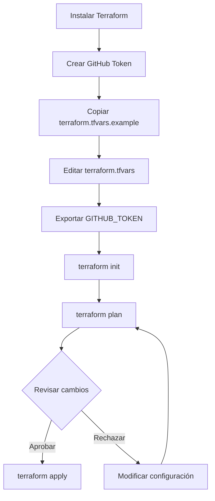
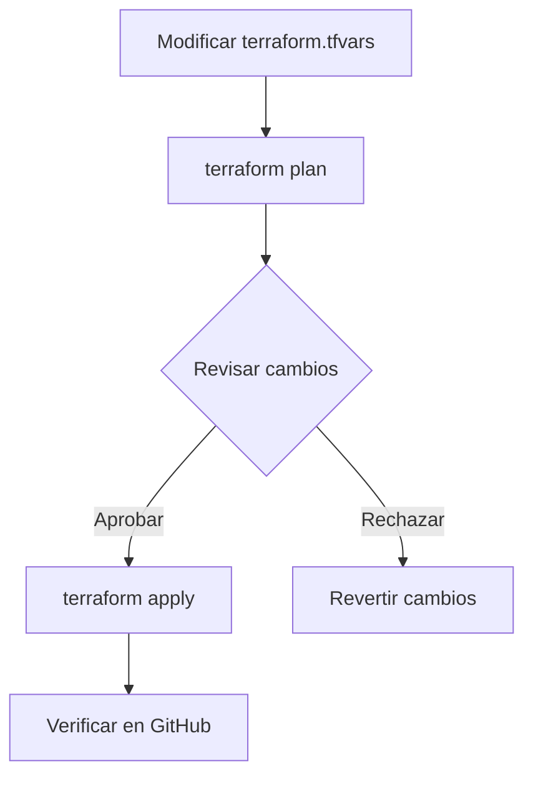
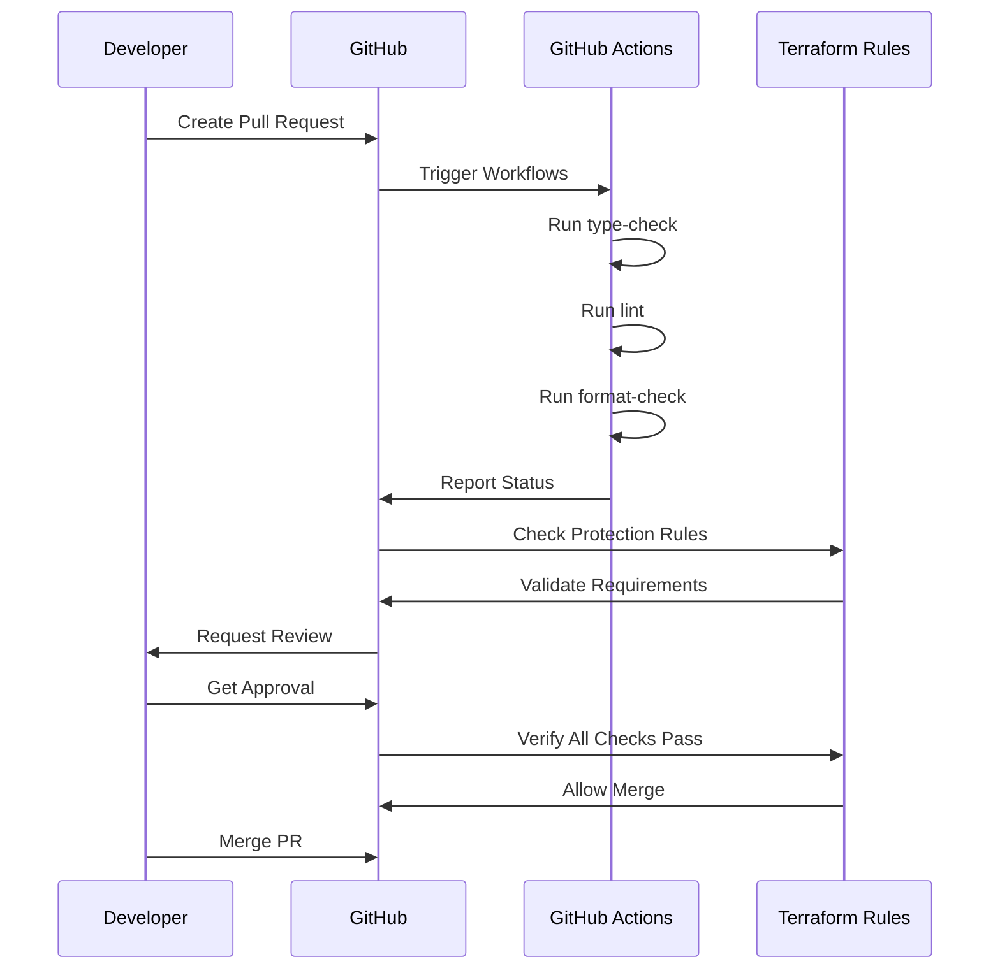

# Terraform Architecture for Branch Protection

## 📐 Overview

Esta configuración de Terraform gestiona las reglas de protección de ramas de GitHub de manera declarativa, permitiendo versionar y auditar los cambios en las políticas de seguridad del repositorio.

## 🏗️ Estructura de Archivos

```
terraform/
├── main.tf                      # Configuración principal y provider
├── variables.tf                 # Definición de variables
├── branch-protection.tf         # Recursos de protección de ramas
├── outputs.tf                   # Outputs de Terraform
├── terraform.tfvars.example     # Ejemplo de configuración
├── .gitignore                   # Archivos a ignorar
├── Makefile                     # Comandos útiles
├── setup.sh                     # Script de configuración inicial
├── README.md                    # Documentación de uso
├── ARCHITECTURE.md              # Este archivo
└── environments/                # Configuraciones por entorno
    ├── development.tfvars       # Configuración de desarrollo
    └── production.tfvars        # Configuración de producción
```

## 🔧 Componentes

### 1. Provider Configuration (`main.tf`)

```hcl
provider "github" {
  token = var.github_token
  owner = var.github_owner
}
```

**Propósito:** Configura la conexión con la API de GitHub usando el token de autenticación.

**Variables requeridas:**

- `github_token`: Token de acceso personal con permisos `repo` y `admin:repo_hook`
- `github_owner`: Usuario u organización de GitHub

### 2. Variables (`variables.tf`)

Define todas las variables configurables:

| Variable                          | Tipo         | Default                                | Descripción                           |
| --------------------------------- | ------------ | -------------------------------------- | ------------------------------------- |
| `protected_branches`              | list(string) | ["main", "develop"]                    | Ramas a proteger                      |
| `required_approving_review_count` | number       | 1                                      | Número de aprobaciones requeridas     |
| `dismiss_stale_reviews`           | bool         | true                                   | Descartar aprobaciones obsoletas      |
| `require_conversation_resolution` | bool         | true                                   | Requerir resolución de conversaciones |
| `required_status_checks`          | list(string) | ["type-check", "lint", "format-check"] | Checks requeridos                     |
| `enforce_admins`                  | bool         | false                                  | Aplicar restricciones a admins        |
| `allow_force_pushes`              | bool         | false                                  | Permitir force pushes                 |
| `require_linear_history`          | bool         | false                                  | Requerir historial lineal             |
| `require_signed_commits`          | bool         | false                                  | Requerir commits firmados             |

### 3. Branch Protection Resource (`branch-protection.tf`)

```hcl
resource "github_branch_protection" "protected_branches" {
  for_each = toset(var.protected_branches)

  repository_id = data.github_repository.repo.node_id
  pattern       = each.value

  # ... configuración de protección
}
```

**Características:**

- Usa `for_each` para crear múltiples reglas de protección
- Referencia el repositorio mediante data source
- Configura todas las opciones de protección de manera declarativa

### 4. Data Sources

```hcl
data "github_repository" "repo" {
  full_name = "${var.github_owner}/${var.repository_name}"
}
```

**Propósito:** Obtiene información del repositorio existente sin crearlo.

### 5. Outputs (`outputs.tf`)

Expone información útil después de aplicar la configuración:

- ID del repositorio
- Nombre completo del repositorio
- Ramas protegidas
- Resumen de reglas aplicadas

## 🔄 Flujo de Trabajo

### Configuración Inicial



### Actualización de Reglas



## 🌍 Gestión de Entornos

### Development Environment

**Archivo:** `environments/development.tfvars`

**Características:**

- Protege `main` y `develop`
- 1 aprobación requerida
- No requiere code owner reviews
- Checks básicos (type-check, lint, format-check)
- No requiere historial lineal
- No requiere commits firmados

**Uso:**

```bash
make plan ENV=development
make apply ENV=development
```

### Production Environment

**Archivo:** `environments/production.tfvars`

**Características:**

- Solo protege `main`
- 2 aprobaciones requeridas
- Requiere code owner reviews
- Checks completos (incluye test y build)
- Requiere historial lineal
- Requiere commits firmados
- Aplica restricciones a administradores

**Uso:**

```bash
make plan ENV=production
make apply ENV=production
```

## 🔐 Seguridad

### Gestión de Tokens

**Nunca commitear tokens al repositorio:**

```bash
# ✅ Correcto: Variable de entorno
export GITHUB_TOKEN="ghp_..."

# ❌ Incorrecto: En terraform.tfvars
github_token = "ghp_..."  # NO HACER ESTO
```

### Permisos Requeridos

El token de GitHub debe tener:

- ✅ `repo` - Full control of private repositories
- ✅ `admin:repo_hook` - Full control of repository hooks

### Archivos Sensibles

El `.gitignore` excluye:

- `*.tfvars` (excepto `.example`)
- `*.tfstate`
- `.terraform/`
- Archivos de plan

## 🔗 Integración con CI/CD

### GitHub Actions

Los status checks configurados en Terraform deben corresponder con los jobs de GitHub Actions:

**Terraform:**

```hcl
required_status_checks = [
  "type-check",
  "lint",
  "format-check"
]
```

**GitHub Actions (`.github/workflows/checks.yml`):**

```yaml
jobs:
  type-check:
    name: type-check # ← Debe coincidir
    # ...

  lint:
    name: lint # ← Debe coincidir
    # ...

  format-check:
    name: format-check # ← Debe coincidir
    # ...
```

### Flujo de Pull Request



## 📊 Estado y Backend

### Local State (Default)

Por defecto, Terraform guarda el estado localmente en `terraform.tfstate`.

**Ventajas:**

- Simple para proyectos individuales
- No requiere configuración adicional

**Desventajas:**

- No compartible entre equipo
- Riesgo de pérdida de datos
- No hay bloqueo de estado

### Remote State (Recomendado para equipos)

Para equipos, configura un backend remoto en `main.tf`:

```hcl
terraform {
  backend "s3" {
    bucket = "your-terraform-state-bucket"
    key    = "github/branch-protection/terraform.tfstate"
    region = "us-east-1"

    # Opcional: DynamoDB para bloqueo de estado
    dynamodb_table = "terraform-state-lock"
    encrypt        = true
  }
}
```

**Alternativas:**

- Terraform Cloud
- Azure Blob Storage
- Google Cloud Storage
- Consul

## 🧪 Testing

### Validación Local

```bash
# Validar sintaxis
terraform validate

# Formatear archivos
terraform fmt -check

# Plan sin aplicar
terraform plan
```

### Dry Run

```bash
# Ver cambios sin aplicar
terraform plan -out=tfplan

# Inspeccionar plan
terraform show tfplan
```

## 📈 Mejores Prácticas

### 1. Versionado

- ✅ Commitear archivos `.tf`
- ✅ Commitear `.example` files
- ❌ NO commitear `.tfvars` con datos sensibles
- ❌ NO commitear `.tfstate`

### 2. Revisión de Cambios

Siempre revisar el plan antes de aplicar:

```bash
terraform plan | tee plan.txt
# Revisar plan.txt
terraform apply
```

### 3. Documentación

Mantener actualizado:

- Variables en `variables.tf`
- Outputs en `outputs.tf`
- README con ejemplos
- ARCHITECTURE con decisiones de diseño

### 4. Modularización

Para proyectos grandes, considera crear módulos:

```
terraform/
├── modules/
│   ├── branch-protection/
│   │   ├── main.tf
│   │   ├── variables.tf
│   │   └── outputs.tf
│   └── repository/
│       ├── main.tf
│       ├── variables.tf
│       └── outputs.tf
└── main.tf
```

## 🐛 Troubleshooting

### Error: "Resource not found"

**Causa:** Token sin permisos o repositorio incorrecto

**Solución:**

```bash
# Verificar token
echo $GITHUB_TOKEN

# Verificar configuración
terraform console
> var.github_owner
> var.repository_name
```

### Error: "Status check not found"

**Causa:** El status check no ha sido ejecutado nunca

**Solución:**

1. Ejecutar GitHub Actions al menos una vez
2. Verificar que el nombre del job coincida exactamente
3. Aplicar Terraform después de que los checks existan

### Estado Inconsistente

**Causa:** Cambios manuales en GitHub

**Solución:**

```bash
# Refrescar estado
terraform refresh

# Importar recursos existentes
terraform import github_branch_protection.protected_branches["main"] "repo_name:main"
```

## 📚 Referencias

- [Terraform GitHub Provider](https://registry.terraform.io/providers/integrations/github/latest/docs)
- [GitHub Branch Protection API](https://docs.github.com/en/rest/branches/branch-protection)
- [Terraform Best Practices](https://www.terraform-best-practices.com/)
- [GitHub Actions Documentation](https://docs.github.com/en/actions)
